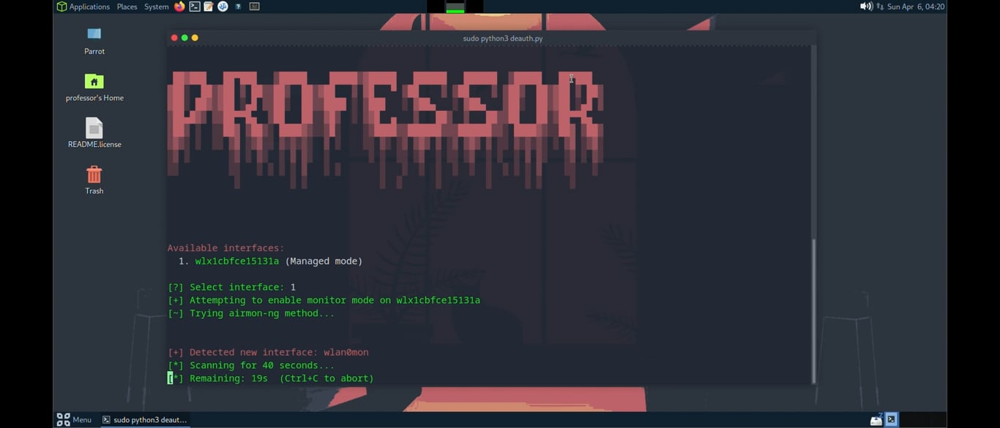

# 🔥 Wi-Fi Deauth Attack Automation Tool


> 
**Automated wireless deauthentication attack tool**

---

## 🚀 Features

- 📶 Scans and lists all nearby Wi-Fi networks
- 🎯 Select target from menu to launch deauth attack
- ⏱️ Countdown while scan is running
- 🧠 Auto-detection logic — auto list Wi-Fi adapter
- ✅ Auto-restores the Wi-Fi adapter to managed mode after stopping

---

## ⚙️ Requirements

- A Wi-Fi adapter that supports **monitor mode** and **packet injection**
- Python 3


---

## 📦 Installation

```bash
git clone https://github.com/Prof445/auto-deauth.git
cd auto-deauth
```
---

▶️ Usage

```bash
sudo python3 deauth.py
```

## 🎥 Demo

[](https://vimeo.com/1072874402?share=copy#t=0)

---

⚠️ Press Ctrl + C to stop the attack and restore your Wi-Fi adapter to normal mode

---

🛡️ Disclaimer

This tool is intended strictly for educational and authorized security testing purposes only.
Do not use this on any network you do not own or have explicit permission to test.

---

🧠 Author

Made with ❤️ by Professor
